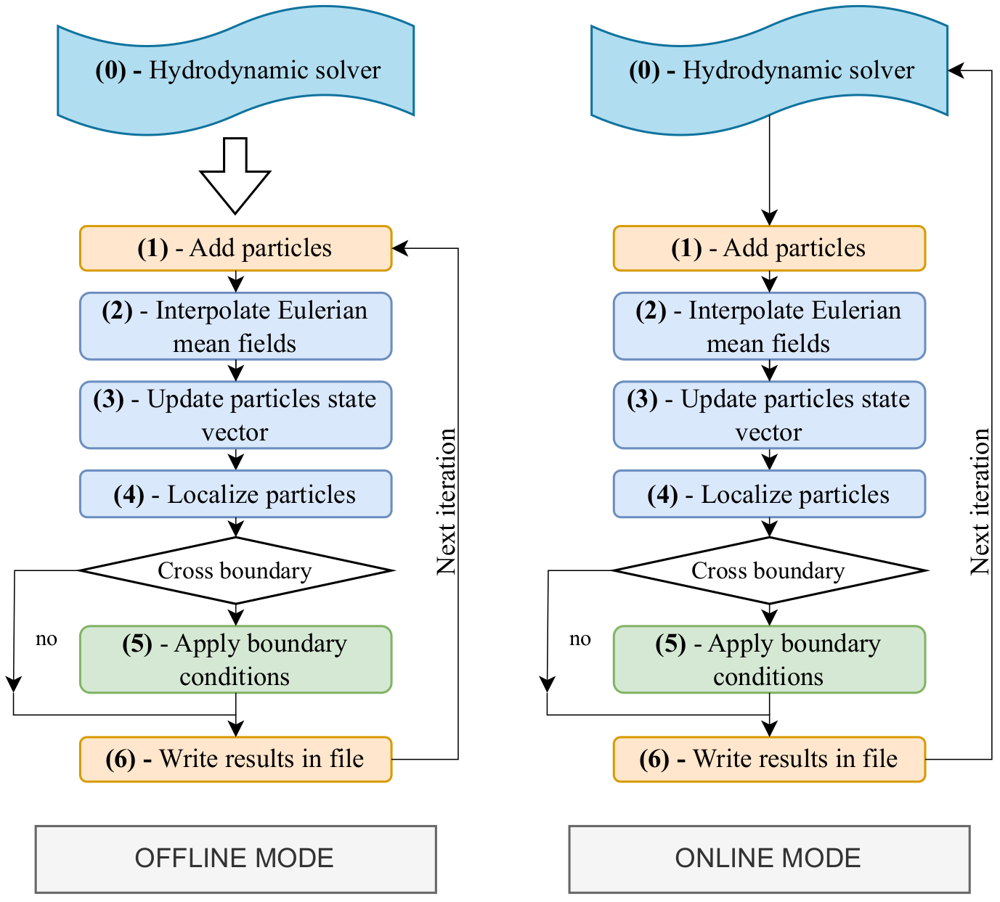
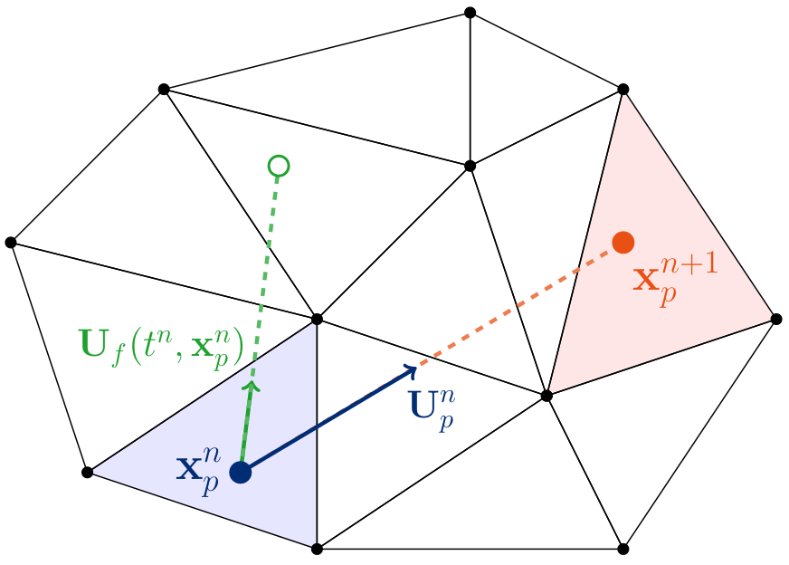
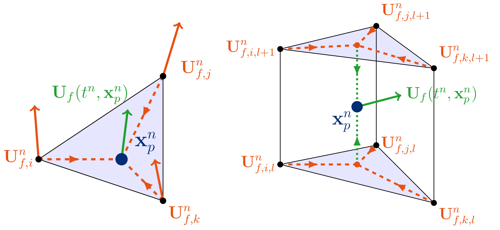
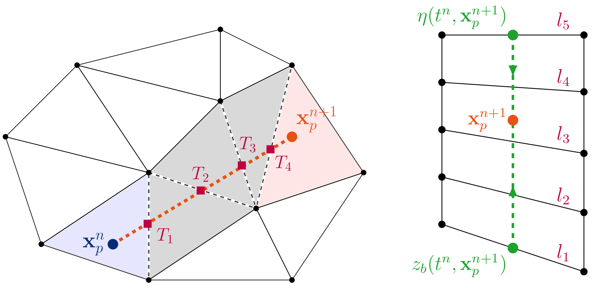
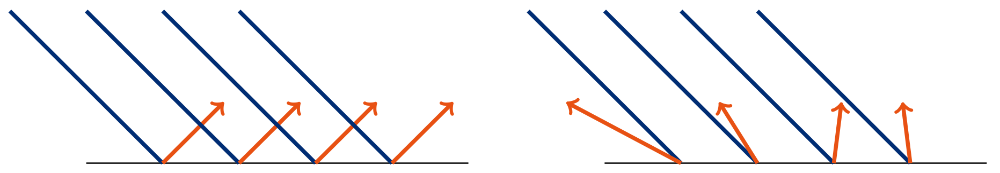
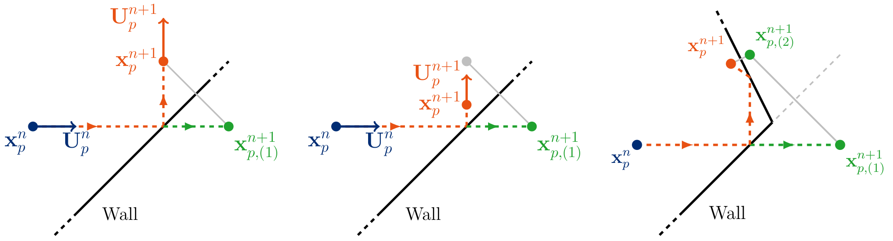

.. _algo:

******************************************************************************
Particle-mesh implementation
******************************************************************************

General overview of the algorithm
==============================================================================

CyLag's hybrid Eulerian-Lagrangian implementation relies on an Eulerian solver, whose results are computed on a 2D triangular mesh or a 3D mesh (triangular prismatic elements).
CyLag's Lagrangian solver then computes the motion of particles that are embedded in the computational domain
using Lagrangian Stochastic Models (LSMs) described in section :ref:`models`.

The time loop associated with CyLag's Lagrangian solvers can be executed independently from the Eulerian solver in **offline** mode.
The offline mode implies that only one-way coupling can be achieved. More importantly, it requires the Eulerian results
to be saved with a sufficiently high frequency in order to avoid errors induced by poor time resolution.
These drawbacks can be avoided by using the Lagrangian solver in the same time loop as the Eulerian solver, which is called
**online** mode. This mode is available through the use of both CyLag and TELEMAC Python APIs.

.. _fig_solver:

    *Figure 1: Flowchart of the main time loop of CyLag with the OFFLINE mode (left) or ONLINE mode (right). Step (1) and (6) are optional and are executed only at chosen time steps.*
    
Solving Lagrangian Stochastic Models (LSMs) relies on several successive
steps, which are illustrated in Figure 1.
Particles are first added within the domain, and then the mean fields (such as the fluid velocity) are interpolated at the location of the particles.
The particle equations (LSMs) are solved using appropriate time schemes, and the particle state vector is updated.
After the update, the particles are localized, and boundary conditions are applied if any boundary edge (2D) or surface (3D) has been crossed.
Boundary conditions include rebounds on the walls or outlet boundary conditions.
Finally, the particle state vectors are written to output files.
In the following, the algorithms implemented for interpolation, particle search, and boundary conditions are described.

.. _fig_part_mesh:

    *Figure 2: Particle position update and trajectory separation illustration. The green line indicates the fluid material path line whereas the red line indicates the particle trajectory.*

Interpolation
==============================================================================

**1. Time interpolation**

When using CyLag in offline mode, the mean fields required for the Lagrangian solver are not available at the same times 
if the time step of the Lagrangian solver is different from the Eulerian solver.
In this case, linear time interpolation is carried out to compute the mean fields at the 
Lagrangian time :math:`t^n` from the closest Eulerian times :math:`t^k` and :math:`t^{k+1}` such that

.. math::
  \mathcal{F}(t^k \leq t^n<t^{k+1}, \bold{x}) = \alpha \mathcal{F}(t^{k}, \bold{x}) + (1-\alpha) \mathcal{F}(t^{k+1}, \bold{x}),

where :math:`\mathcal{F}(t^n, \bold{x})` is the Eulerian mean field evaluated at Lagrangian time step :math:`t^n`,
and where :math:`\alpha = \dfrac{t^{k+1} - t^n}{t^{k+1} - t^k}`.

**2. Spatial interpolation**

Eulerian mean fields interpolation at the particle position is done via linear interpolation by default
as presented in Figure 3.
In 3D, the results files are assumed to contain only triangular prismatic elements, which result from an extrusion of a 2D triangular mesh
(TELEMAC-3D result files).

.. _fig_interp:

    
    *Figure 3: Interpolation of the fluid mean velocity field at the particle's location in 2D (left) and 3D (right). Indices i, k, j are the nodes of the 2D triangular mesh while l and l+1 are the indices of the 3D mesh layers.*

Search algorithm
==============================================================================

Once particle positions are updated, their location in the mesh (triangle and surrounding layers) needs to be updated
in order to interpolate at the next time step and to apply boundary conditions if the particles are crossing boundary edges (2D) or surfaces (3D).

**1. Horizontal search**

Several search algorithms have been implemented in CyLag:

- **KDTree**: Search all triangles (using a KDTree)

  - Used for initialization
  - O(log nt + k) complexity

- **Neighborhood Search**: Search neighboring triangles

  - Uses triangle adjacency tables
  - O(1) if particle hasn't moved far

- **Path Following**: Trace a segment from the old to the new position

  - Finds intersections with mesh edges
  - Efficient for moderate displacements
  - Returns boundary edge if particle exits

- **Hierarchical**: Path → KDTree

By default, the hierarchical search is used in CyLag.
First, we carry out a Path Following search, and if the particle is not found, we use a KDTree search as a fallback.

The recursive edge-intersection and edge-to-triangle mapping algorithm (see Figure 4) consists of starting from the previous known position :math:`\bold{x}_p^n` and the associated triangle :math:`T_i`.
The edge of the triangle :math:`T_i` that is intersected by the segment :math:`[\bold{x}_p^n, \bold{x}_p^{n+1}]` is
determined in order to search in the neighboring triangle :math:`T_j`. If the position :math:`\bold{x}_p^{n+1}` is not found in :math:`T_j`,
we start again from :math:`T_j` and eliminate the previous intersected edge from the intersection search.
If the point :math:`\bold{x}_p^{n+1}` lies in the neighboring triangles of :math:`T_i`, the maximum cost of the algorithm is only three intersections and one point-in-triangle test.
Note that the optimized search algorithm requires the previous position to be known; the particles are therefore localized using KDTree search for initialization.

.. _fig_localisation:

    
    *Figure 4: Illustration of the 2D optimized search algorithm (left) and vertical localization algorithm (right). Purple rectangles indicate successive intersections and Tj the triangles in which the new particle position is searched. In this example, four points in triangle tests are performed until the position is found.*

**2. Vertical search (for 3D only)**

For 3D applications, horizontal localization is unchanged, while vertical localization is achieved by interpolation of the free surface and bottom at the particle location and assuming
a regular vertical layer spacing. The algorithm could be adapted to irregular vertical discretization as long as an analytical formula can be provided for the layer spacing and if the layer spacing does not vary in space.

Boundary conditions
==============================================================================

Different boundary conditions are applied depending on the type of boundary edge (or surface) that a particle goes through.
We distinguish three main types of boundary conditions.

- **Open inlet boundary**: particles are entering the domain through an open inflow boundary condition.
- **Open outlet boundary**: particles are leaving the domain and are removed from the pool of active particles.
- **Wall boundary (rebound)**: particles interact with a wall, which can be a lateral wall, the bottom, or the free surface.

**1. Rebound boundary conditions**

Wall boundary conditions are very important in order for the particles to stay inside the computational domain
and maintain the well-mixed condition.
Two types of rebound can be considered, as illustrated in Figure 5. The most straightforward is the specular rebound, which corresponds to the rebound of a spherical
particle on a planar surface.
The second option is the diffuse rebound, for which the direction of the particle velocity vector after the rebound is no longer deterministic but rather follows a 
PDF that describes the dispersion of the trajectories due to surface roughness.
The choice between specular and diffuse rebound is made through the parameter ``param:boundary_conditions_type`` (1 for specular, 2 for diffuse).

.. _fig_rebound:

    
    *Figure 5: Specular rebound (left) and diffuse rebound (right).*

*1.1 Specular rebound*

The computation of specular rebounds is based on intersections and symmetric point computations.
In 2D, it only involves segment intersection and reflection, while in 3D, it requires segment-face intersection and surface reflection, which are computationally more demanding.
The rebound algorithm implemented in CyLag is compatible with multiple reflections to avoid stuck particles in complex geometries.
An example is given in Figure 6 for 2D planar reflections.
A maximum number of rebounds is allowed in order to avoid excessive cost due to stuck particles (``param:max_wall_rebounds``, set to 4 by default). Stuck particles can occur in very shallow 3D models when wetting and drying are present in the model.
Also, another simplified algorithm is proposed for such cases, in which only 2D reflections are computed on the side of the 3D mesh.
Besides, a damping coefficient is added to model the energy loss due to the collision (``param:rebound_damping_coef``), in which case the velocity of the particle is reduced after the rebound. The default damping is set to 0.5, i.e. particles lose half of their kinetic energy in collisions.
Additionally, when particles reach the free surface or the bottom, the reflection distance is limited to half the water depth to avoid a very high number of reflections in drying areas where the water depth is close to zero.

  
    *Figure 6: 2D illustration of specular rebound boundary condition without damping (left), with damping (center) and example of multiple rebounds (right). The red dotted line represents the real trajectory of the particle after rebound while the green dotted line represents the trajectory without rebound.*

*1.2 Diffuse rebound*

Following the classic stochastic rough-wall approach (Sommerfeld, 1992), the true geometric wall is kept for repositioning the particle, 
but the local wall normal used for the velocity reflection is randomly perturbed by an angle :math:`\theta` sampled around 0 with std-dev 
``param:wall_roughness_angle`` (in degree), drawn via the RNG function. This simulates microscopic surface roughness causing quasi-random scattering instead of a perfect mirror bounce,
while still conserving speed/energy consistently with the existing damping scheme.

**2. Stranding**

When particles reach a wall boundary that corresponds to a coastline, the particles could stay on the shore.
To take that into account, a stranding probability is included in CyLag (see ``param:stranding_probability``).
When a particle rebound is triggered, the stranding probability is applied; if stranded, the particle is deleted from the active pool of particles.
