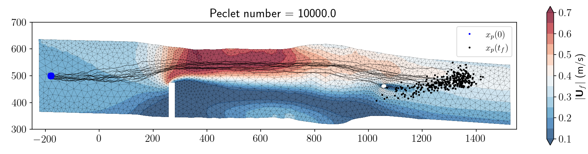

.. cylag documentation master file

******************************************************************************
Presentation
******************************************************************************

**CyLag** is a high-performance Cython-based framework for simulating Lagrangian particle transport and dispersion in fluid flows, with a particular focus on free-surface hydrodynamic applications.

- **Version**: 0.9
- **Author**: Fabien Souillé (EDF R&D, LNHE)
- **First release date**: 2023
- **Language**: Cython_
- **License**: GNU_GPL_v3_

.. raw:: html

    <video style="display:block; margin: 0 auto;" controls autoplay src="_static/video/tide.mp4" width="600" ></video>
    
 <i>Example of a simulation with TELEMAC-2D/CyLag (tide example)</i> 

Key Features
================================================================================

CyLag simulates the transport and dispersion of particles in fluid flows using a **hybrid Eulerian-Lagrangian approach**:

- **Eulerian**: flow fields (velocity, turbulence) computed on a fixed mesh by a hydrodynamic solver (such as openTELEMAC_)
- **Lagrangian**: individual particles tracked through the flow by solving a Lagrangian Stochastic Model (LSM)

    
    *Example of a simulation with TELEMAC-2D/CyLag (flume example)*.

Key Features of CyLag include:

- **Multiple Lagrangian Stochastic Models (LSM)**:

  - LSM-1: Simple advection-diffusion (state: position only)
  - LSM-2: Newton's second law of motion for each particle + velocity dispersion (state: position + velocity)
  - LSM-3: Advanced turbulent dispersion model (state: position + velocity + fluid velocity seen)

- **Online/Offline modes**:

  - Offline mode allows multiple computations from a single hydrodynamic simulation
  - Online mode is still available and designed to be used with the TELEMAC API

- **Flexible Mesh Support**:

  - Unstructured triangular meshes in 2D/3D
  - Support for TELEMAC format

- **High Performance**:

  - Written in Cython for C-level speed
  - Optimized memory layouts for cache efficiency
  - Fast point localization algorithms
  - Optional MPI parallelization for large-scale simulations
  
- **Physical Realism**:

  - Turbulent diffusion with various closure models
  - Wall rebound and open boundary conditions
  - Particle-fluid interaction (drag, added mass, buoyancy)
  - Multiple drag coefficient models

- **Various Modules**:

  - *Oil slick module*: for the modeling of oil spill accidents
  - *Algae module*: for the modeling of algae transport
  - *Macrophytes module*: for the simulation of uprooted aquatic vegetation
  - *Fish module*: for the simulation of aquatic wildlife behavior
  - *Jellyfish module*: for the modeling of jellyfish transport

Get started
================================================================================

To get started, see the :ref:`Get_started` tutorial for the basic installation procedure and basic simulation setup with CyLag.
For details on how to set up a simulation with CyLag, see the :ref:`setup` and :ref:`Good_practices` sections.
You may also want to check the gallery of examples, in which several simulation examples are provided with the corresponding scripts.
Theoretical aspects and a description of the mathematical models are provided in the :ref:`models` section.

**Need help?** Send an email to: `fabien.souille@edf.fr <fabien.souille@edf.fr>`_

Table of Contents
================================================================================

.. toctree::
   :maxdepth: 2
   :caption: Contents:
   
   get_started
   models
   algo
   setup
   Gallery of examples<auto_examples/index>
   good_practices
   dev
   API<api/modules>
   
License
================================================================================

Project name: CyLag Copyright (C) 2023 Fabien Souille

This program is free: you can redistribute it and/or modify it under the terms of the GNU General Public License published by the Free Software Foundation, either version 3 of the license, or (at your option) any later version.

This program is distributed in the hope that it will be useful, but WITHOUT ANY WARRANTY; without even the implied warranty of MERCHANTABILITY or FITNESS FOR A PARTICULAR PURPOSE.

See the GNU General Public License for details.

You should have received a copy of the GNU General Public License with this program. If not, see <https://www.gnu.org/licenses/>.

.. _Cython: http://cython.org/
.. _openTELEMAC: https://www.opentelemac.org/
.. _GNU_GPL_v3: https://opensource.org/license/gpl-3.0
