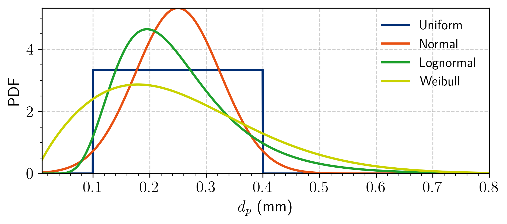
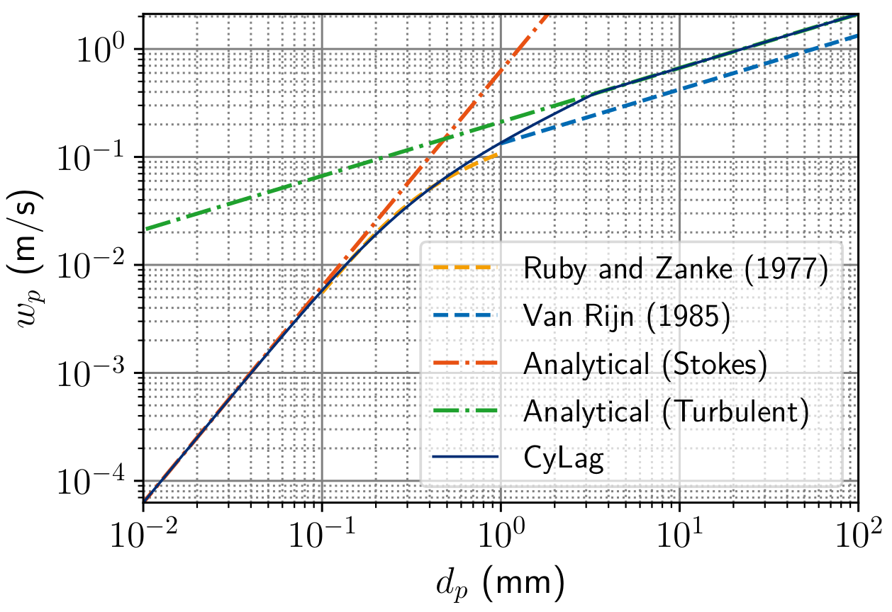
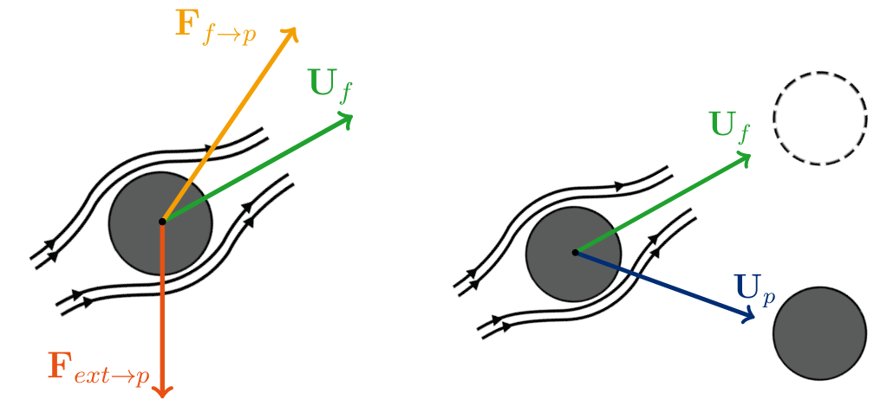
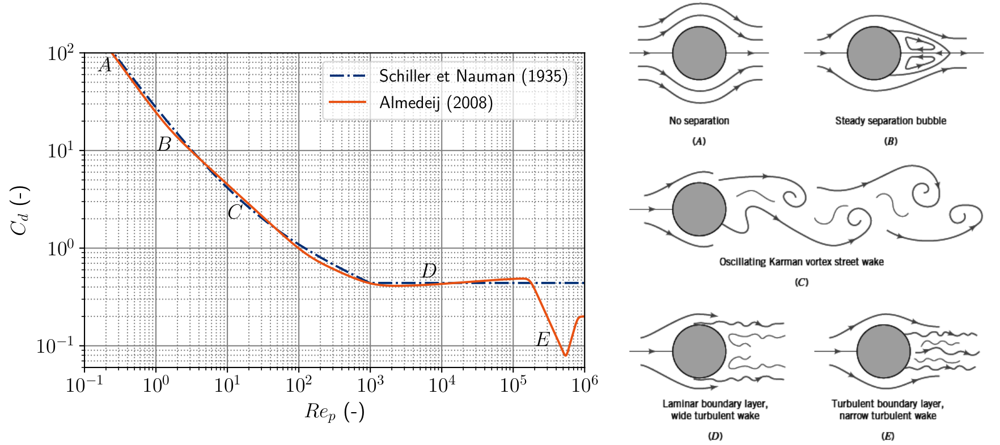
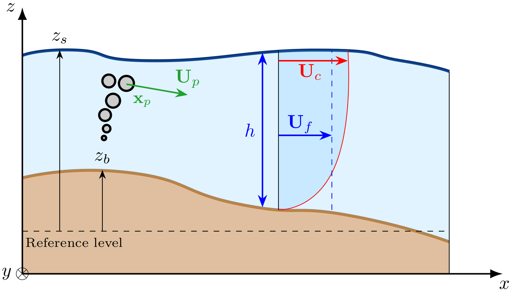

.. _models:

******************************************************************************
Mathematical models
******************************************************************************

Overview
==============================================================================

CyLag implements several general Lagrangian formulations, in 2D and 3D, 
allowing the framework to accommodate a wide range of applications through the adjustment of 
closure relations associated with the forces acting on particles (e.g., drag, buoyancy, and additional forces), 
distribution of particle sizes, choice of numerical integration schemes,
as well as through different diffusion parameterizations.

.. note::

  In the following, the parameters of the models that can be modified in CyLag are tagged as follows:

  - ``fset:parameter``: passed to the ``EulerianFieldSet`` object,
  - ``pset:parameter``: passed to the ``LagrangianParticleSet`` object,
  - ``param:parameter``: passed to the ``parameters`` dictionary.

**Lagrangian Stochastic Models**

Three Lagrangian Stochastic Models (LSMs) of increasing complexity are available, distinguished by the definition of the particle state vector. The simplest formulation, LSM-1, considers only the particle position (denoted :math:`\mathbf{x}_p`) and describes transport through an advection-diffusion process. LSM-2 extends the state vector by introducing the particle velocity (denoted :math:`\mathbf{U}_p`), thereby accounting for inertial effects through Newton's equation of motion. Finally, LSM-3 includes the fluid velocity seen by the particle (denoted :math:`\mathbf{U}_s`) in addition to its position and velocity and relies on a generalized Langevin formulation to represent turbulent velocity fluctuations and their temporal correlations. Together, these models provide a flexible framework for simulating a broad spectrum of transported substances, ranging from passive tracers to inertial particles in turbulent free-surface flows. In this section, the governing equations associated with these three model formulations are presented.

- :ref:`LSM-1 (Lagrangian Stochastic Model n°1)<lsm1_section>`: one equation (position only).
- :ref:`LSM-2 (Lagrangian Stochastic Model n°2)<lsm2_section>`: two equations (position and velocity).
- :ref:`LSM-3 (Lagrangian Stochastic Model n°3)<lsm3_section>`: three equations (position, velocity, and fluid velocity seen).

.. raw:: html

   

**Numerical methods**

Numerical integration methods differ depending on whether the governing equations constitute a system of ordinary differential equations (ODEs) in the absence of diffusion or a system of stochastic differential equations (SDEs). The numerical integration of SDEs involves stochastic integrals, which preclude the direct application of classical deterministic methods developed for ODEs, such as high-order Runge-Kutta schemes. Consequently, both the mathematical formulation of the problem and the nature of the governing equations strongly influence the choice of the numerical integration method.
Table 1 summarizes the different model formulations implemented in CyLag, together with their underlying assumptions and corresponding numerical schemes.

.. table:: Description of CyLag Lagrangian models and associated numerical schemes. Euler-Maruyama (EM), Euler (E), second-order (RK2), third order (RK3) fourth-order (RK4) Runge-Kutta, and Direct Integration (DI).
   :name: table-cylag-formulations

   .. list-table::
      :header-rows: 1
      :widths: 8 12 8 25 8 14

      * - Model
        - State vector
        - Diffusion
        - Model name
        - Equations
        - Schemes

      * - **LSM-1**
        - :math:`\{\mathbf{x}_p\}`
        - Yes
        - Random Displacement Model
        - SDE
        - EM

      * - **LSM-1**
        - :math:`\{\mathbf{x}_p\}`
        - No
        - Material path-lines
        - ODE
        - E, RK2, RK3, RK4

      * - **LSM-2**
        - :math:`\{\mathbf{x}_p,\mathbf{U}_p\}`
        - Yes
        - Langevin model
        - SDE
        - EM, DI

      * - **LSM-2**
        - :math:`\{\mathbf{x}_p,\mathbf{U}_p\}`
        - No
        - Newton model
        - ODE
        - E, RK2, RK3, RK4, DI

      * - **LSM-3**
        - :math:`\{\mathbf{x}_p,\mathbf{U}_p,\mathbf{U}_s\}`
        - Yes
        - Generalized Langevin
        - SDE
        - EM, DI
        
|

.. raw:: html

   

**Dimension**

The Lagrangian Stochastic Models in CyLag can be solved 
using 2D (:math:`\mathbf{x}_p, \mathbf{U}_p, \mathbf{U}_s \in \mathbb{R}^2`)
or 3D particles (:math:`\mathbf{x}_p, \mathbf{U}_p, \mathbf{U}_s \in \mathbb{R}^3`).
While 2D particles can only be used with 2D Eulerian field set the 3D particles can be used 
with either 2D or 3D field set.
The selection of the model is done by modifying the value of the ``pset:dim`` 
and ``fset:dim`` parameters.
The available options are as follows :

- :ref:`2D simulation <2d>`: ``pset:dim=2`` with ``fset:dim=2``;
- :ref:`3D simulation <3d>`: ``pset:dim=3`` with ``fset:dim=3``;
- :ref:`Pseudo-3D simulation <p3d>`: ``pset:dim=3`` with ``fset:dim=2``.

.. note::

  The models used for hydrodynamics are not detailed here, for more information please refer to the TELEMAC_ theory guides.

.. _2d: 

.. _3d:

In Figure 1, we illustrate of the different dimensions of the ``LagrangianParticleSet`` and ``EulerianFieldSet`` objects, 
as well as the main notations. In the following, we denote
:math:`z_b` the bottom elevation,
:math:`z_s` the free surface elevation, 
:math:`h = z_s - z_b` the water depth and
:math:`\mathbf{U}_f` the mean fluid velocity, which can be either: :math:`\mathbf{U}_f = (u_f,v_f) \in \mathbb{R}^2` 
or: :math:`\mathbf{U}_f = (u_f,v_f,w_f) \in \mathbb{R}^3` depending on ``fset.dim``.

.. list-table:: Illustration of ``LagrangianParticleSet`` and ``EulerianFieldSet`` dimensions and main notations :
   :widths: 30 30 30

   * - .. figure:: _static/images/fluid_domain_2D.png
          :width: 100%

          *Figure 1: (a) 2D*

     - .. figure:: _static/images/fluid_domain_pseudo3D.png
          :width: 100%

          *(b) pseudo-3D*

     - .. figure:: _static/images/fluid_domain_3D.png
          :width: 100%

          *(c) 3D*

**Particle distribution**

CyLag supports both mono-disperse and poly-disperse particle set.
In the first case all particles are assumed to have the same size while the second option  
accounts for the natural variability in particle size.
For poly-disperse modeling, CyLag supports several particle-diameter distributions (see Figure 2).
User needs to provide the mean particle diameter ``pset.particle_diameter``
and a distribution ``pset.particle_diameter_distribution`` which is a ``list`` containing the
distribution type and main parameter (e.g. ``['uniform', 0.5]``).
The options are as follows:

- ``None`` : mono-disperse particle set, all particles have the same size equal to ``pset.particle_diameter``;
- [``uniform``, :math:`\Delta`] : :math:`d_p \sim U(\mu-\Delta, \mu+\Delta)` with ``pset.particle_diameter`` :math:`=\mu`, :math:`\Delta=` half-width;
- [``normal``, :math:`\sigma`] : :math:`d_p \sim N(\mu, \sigma^2)` with ``pset.particle_diameter`` :math:`=\mu`, :math:`\sigma=` standard deviation;
- [``lognormal``, :math:`GSD`] : :math:`\ln(d_p) \sim N(\mu_l,\sigma_l^2)` with ``pset.particle_diameter`` :math:`=E[d_p]`, :math:`e^{\sigma_l} = GSD`;
- [``weibull``, :math:`k`] : :math:`d_p \sim \text{Wei}(k,\lambda)` with :math:`\lambda = E[d_p]/\Gamma(1+1/k)`, ``pset.particle_diameter`` :math:`=E[d_p]`, :math:`k=` shape.
- [``tabulated``, None] : user-defined tabulated distribution, with the first column containing the particle diameters and 
  the second column containing the corresponding cumulative distribution function (CDF) values. 
  The tabulated distribution must be defined in ``cylag/core/particle_distribution.pyx`` and CyLag must be re-compiled.

These distributions enable the representation of both symmetric and skewed particle-size populations, 
providing flexibility for modelling a wide range of particle types.

.. _fig_dist:

    
    *Figure 2: Example of particle distributions available in CyLag*.

.. note::

  To prevent nonphysical diameters and avoid artificial concentrations at the bounds,
  we use truncation by rejection sampling: values outside the prescribed diameter range (<1.e-12, >10) are discarded and redrawn.
  Note that this truncation modifies the distribution’s mean, variance, and higher moments when many samples are rejected.

.. _lsm1_section:

Lagrangian Stochastic Model n°1 (LSM-1)
==============================================================================

The LSM-1 formulation is the simplest model implemented in CyLag.
The particle state vector is restricted to the particle position, and particle motion is described directly through an advection-diffusion equation.
In this framework, particles are transported by the mean flow field, while unresolved turbulent fluctuations are represented by a stochastic displacement term.
As a result, LSM-1 belongs to the family of Random Displacement Models (RDMs) and is particularly well suited for tracer-like particles whose inertia can be neglected.
Owing to its simplicity and low computational cost, it is commonly used for large-scale transport and dispersion studies.

.. raw:: html

   

**1. Particle state vector**: :math:`\{\bold{x}_p\}` (position only)

**2. Main equation**: The evolution of a particle's position is computed as:

.. math::

  dx_{p,i}  = \left( U_{f,i} + U_{b,i} + U_{a,i} + \partial_i K_i \right) dt + \sqrt{2K_{i}} dW_i,

where:

- :math:`i \in \{1,2,3\}` indicates the axis :math:`x,y,z` respectively,
- :math:`\bold{x}_p` is the particle's position,
- :math:`\bold{U}_{f}` is the mean fluid velocity interpolated at the particle's position,
- :math:`\bold{U}_{b} =(0,0,-w_p)` is the buoyancy velocity (only for 3D),
- :math:`\bold{U}_{a}` is an additional velocity (user-defined or module-dependent),
- :math:`\bold{W}` is a Wiener process, whose increment :math:`d\bold{W} = \bold{W}(t+dt)-\bold{W}(t)` is a Gaussian variable with zero mean and variance :math:`dt` (see Figure 4),
- :math:`K_i` :math:`(0 \leq i \leq 2)` are horizontal diffusivity coefficients and :math:`K_3` is the vertical diffusivity coefficient.

.. raw:: html

   

**3. Buoyancy models** (set via ``pset:buoyancy_velocity_model``)

- **Model 0**: constant buoyancy velocity defined via the parameter ``pset:buoyancy_velocity`` (default = 0.)
- **Model 1**: computed within CyLag (see Figure 3) as follows:

  .. math::

     & w_p = \dfrac{g d_{p}^2 }{18 \nu_f} (s-1), \text{ if } d_{p} \leq 10^{-4}, \\

     & w_p = \dfrac{10 \nu_f}{d_{p}} \left( \sqrt{1+ \dfrac{(s-1)g d_{p}^3}{100 \nu_f^2}} -1 \right), \text{ if } 10^{-4} < d_{p} \leq 10^{-3}, \\ 

     & w_p = \sqrt{\dfrac{4d_p g (s-1)}{3 C_d}}, \text{ if } d_{p} \geq 10^{-3},

  where :math:`s = \rho_p/\rho_f`, and 

  - :math:`g` is the gravitational acceleration (set at :math:`g=9.80665`),
  - :math:`\rho_f` is the water density (``param:water_density``, default: 1000),
  - :math:`\rho_p` is the particle density (``pset:particle_density``, default: 1000),
  - :math:`d_p` is the particle diameter (``pset:particle_diameter``, default: 0.01)

.. _fig_buoyancy:

    
    *Figure 3: Buoyancy velocity analytical solution (CyLag LSM-1)*.

.. raw:: html

   

**4. Diffusion models** (set via ``param:diffusion_model``)

- **Model 0**: no diffusion, :math:`K_{i}=0` :math:`(0 \leq i \leq 3)`.
- **Model 1**: constant isotropic diffusivity defined as :math:`K_1 = K_2` (``param:horizontal_diffusivity``) and :math:`K_3` (``param:vertical_diffusivity``).
- **Model 2**: :math:`k-\varepsilon` turbulence model for the horizontal component and constant vertical diffusivity; the horizontal diffusivity is then defined as :math:`K_i=\nu_t/\sigma_c` :math:`(0 \leq i \leq 2)`, in which :math:`\sigma_c` is the Schmidt number (``param:schmidt_number``, default: 0.72) and :math:`\nu_t` is the turbulent diffusivity defined as :math:`\nu_t = C_{\mu} k^2 / \varepsilon`, where :math:`C_{\mu}` is the Prandtl-Kolmogorov constant equal to :math:`C_{\mu}=0.09`.
- **Model 3**: :math:`k-\varepsilon` turbulence model for both horizontal and vertical components, with :math:`K_i=\nu_t/\sigma_c` :math:`(0 \leq i \leq 3)`.

.. note:: 

  When using the :math:`k-\varepsilon` turbulence model, the mean Eulerian fields
  :math:`k` and :math:`\varepsilon` should be passed to the ``EulerianFieldSet`` 
  object with the ``optional_fields`` parameter.

.. note:: 

  The stochastic terms require an RNG (Random Number Generator) to generate the Wiener process increment :math:`d\bold{W}`.
  The RNG can be changed via the parameter ``param:rng_method`` which can have two values:

  - ``param:rng_method=1``: rectangular approximation with mean=0, var=1;
  - ``param:rng_method=2``: Ziggurat method (default);
  - ``param:rng_method=3``: Marsaglia’s polar method.

  All methods use the PCG32 as a base for pseudorandom number generator.

.. list-table:: Illustration of stochastic diffusion in 1D and 2D
   :widths: 30 25 20

   * - .. figure:: _static/images/diffusion_1D.png
          :width: 100%

          *Figure 4: (a) 1D (10 particles)*

     - .. figure:: _static/images/diffusion_2D.png
          :width: 100%

          *(b) 2D (70 particles)*

     - .. figure:: _static/images/diffusion_2D_2.png
          :width: 100%

          *(b) 2D (2000 particles)*

**5. Time integration schemes** (set via ``param:time_scheme``)

- ``param:time_scheme=1``: **Euler** (1st order) or **Euler-Maruyama** (1st order stochastic);
- ``param:time_scheme=2``: **Runge-Kutta 2** (2nd order);
- ``param:time_scheme=3``: **Runge-Kutta 3** (3rd order);
- ``param:time_scheme=4``: **Runge-Kutta 4** (4th order).

.. warning:: 

    High order anticipating methods such as the **Runge-Kutta** schemes are only suitable for ODE systems,
    ensure the diffusion is negligible before using these schemes.

.. _lsm2_section:

Lagrangian Stochastic Model n°2 (LSM-2)
==============================================================================

The LSM-2 formulation extends the state vector by introducing the particle velocity in addition to the particle position.
Particle motion is therefore governed by both a displacement equation and a momentum equation derived from Newton's second law.
This approach allows the model to account for particle inertia and forces such as drag, buoyancy, added mass, pressure-gradient effects, and user-defined external forces.
Compared with LSM-1, LSM-2 is better suited for modeling sediments, floating debris, biological particles, or any substance whose velocity may differ significantly from the local fluid velocity.

.. raw:: html

   

**1. Particle state vector**: :math:`\{\bold{x}_p, \bold{U}_p\}` (position, velocity)

**2. Main equations**: Newton's second law of motion is solved for every particle, leading to a set of two equations for the update of the position and velocity. Two variants are available in CyLag, depending on whether diffusion is applied to velocity or position (see ``param:diffusion_lsm2_option``):

- **Diffusion on position** (``param:diffusion_lsm2_option=1``): 

.. math::

  & dx_{p,i} = \left( U_{p,i} + \partial_i K_i \right) dt + \sqrt{2K_{i}} dW_i, \\
  & dU_{p,i} = \mathcal{A}_0 g_i dt + \mathcal{A}_1( U_{f,i} - U_{p,i}) dt +  \mathcal{A}_2 d U_{f,i} + \mathcal{A}_3 F_{a,i} dt,

- **Diffusion on velocity** (``param:diffusion_lsm2_option=2 or 3``): 

.. math::

  & dx_{p,i} = U_{p,i} dt, \\
  & dU_{p,i} = \mathcal{A}_0 g_i dt + \mathcal{A}_1( U_{f,i} - U_{p,i}) dt +  \mathcal{A}_2 d U_{f,i} + \mathcal{A}_3 F_{a,i} dt + B_{p,i} dW_i,

where:

- :math:`i \in \{1,2,3\}` indicates the axis :math:`x,y,z` respectively,
- :math:`\bold{g}=(0,0,-g)` is the gravitational acceleration (set at :math:`g=9.80665`),
- :math:`\bold{x}_p` is the particle's position,
- :math:`\bold{U}_{p}` is the particle velocity,
- :math:`\bold{U}_{f}` is the mean fluid velocity interpolated at particle's position,
- :math:`\bold{F}_{a}` is an additional force (user-defined or module-dependent),
- :math:`\bold{W}` is a Wiener process, whose increment :math:`\bold{W} = \bold{W}(t+dt)-\bold{W}(t)` is a Gaussian variable with zero mean and variance :math:`dt`,
- :math:`K_i` :math:`(0 \leq i \leq 2)` are horizontal diffusivity coefficients and :math:`K_3` is the vertical diffusivity coefficient,
- :math:`B_{p,i}` :math:`(0 \leq i \leq 2)` are horizontal velocity diffusivity coefficients and :math:`B_{p,3}` the vertical velocity diffusivity coefficient.

.. _fig_particle_adv:

    
    *Figure 5: Force balance on a spherical particle in a fluid (left) considering external forces such as gravity and fluid forces; and trajectory separation illustration (right). Uf stands for the mean fluid velocity, with which fluid material particles are transported (dotted circle), whereas Up stands for the particle velocity resulting from Newton’s second law of motion and with which solid particles are transported (filled circle).*.

The coefficients :math:`\mathcal{A}_i` are defined by considering the balance of the following forces acting on a particle: *buoyancy*, *drag*, *added mass*, and *pressure gradient*:

- :math:`\mathcal{A}_0 = \dfrac{(\rho_p-\rho_f) }{\rho_p + \rho_f C_a}`,
- :math:`\mathcal{A}_1 = \dfrac{\rho_f S_p C_d |\bold{U}_f - \bold{U}_p|}{2(\rho_p+\rho_f C_a)V_p }`, 
- :math:`\mathcal{A}_2 = \dfrac{\rho_f (1+C_a)}{\rho_p + \rho_f C_a}`, 
- :math:`\mathcal{A}_3 = \dfrac{1}{(\rho_p + \rho_f C_a) V_p}`,

where

- :math:`\rho_f` is the water density (``param:water_density``, default : 1000),
- :math:`\rho_p` is the particle density (``pset:particle_density``, default : 1000), 
- :math:`d_p` is the particle diameter (``pset:particle_diameter``, default : 0.01)
- :math:`S_p` is the apparent surface of the particle, defined as :math:`S_p=\pi d_p^2/4`,
- :math:`V_p` is the particle volume, given by :math:`V_p=\pi d_p^3/6`,
- :math:`C_a` is the added mass coefficient (``pset:added_mass_coef``, default: 0.5),
- :math:`C_d` is the drag coefficient, defined hereafter.

The *added mass* and *pressure gradient* forces can be deactivated (``pset:added_mass_force=False``), in which case we have

- :math:`\mathcal{A}_0 = \dfrac{(\rho_p-\rho_f)}{\rho_p}`,  
- :math:`\mathcal{A}_1 = \dfrac{ \rho_fS_p C_d |\bold{U}_f - \bold{U}_p| }{2 \rho_p V_p}`, 
- :math:`\mathcal{A}_2 = 0`, 
- :math:`\mathcal{A}_3 = \dfrac{1}{\rho_p V_p}`.

.. note:: 

   There is no need to model **buoyancy** with analytical formulas in LSM-2, as it is natively included in the model by taking gravity and drag forces into account.

.. raw:: html

   

**3. Drag models**: different drag models are available for the drag coefficient :math:`C_d` via the parameter ``pset:drag_coefficient_model`` (see Figure 6):

- **Model 0**: constant coefficient defined via the ``pset:drag_coefficient`` parameter,
- **Model 1**: Schiller (1933):

  :math:`C_d = 
  \left\lbrace
  \begin{aligned}
  & \frac{24}{Re_p} \left( 1 + 0.15 Re_p^{0.687} \right)  
  & \quad \text{if} \quad Re_p \leq 1000 \\
  & 0.44   
  & \quad \text{if} \quad Re_p > 1000 
  \end{aligned}\right.`

  where :math:`Re_p = d_p |\bold{U}_f - \bold{U}_p| / \nu_f`, where :math:`\nu_f` is the fluid kinematic viscosity (set at :math:`\nu_f= 1.3 \times 10^{-6}`).

- **Model 2**: Almedeij (2008):

  :math:`\begin{aligned}
  & C_d= \left( \dfrac{1}{(\phi_1+\phi_2)^{-1} + \phi_3^{-1}} + \phi_4   \right)^{1/10} \\
  & \phi_1 = (24 Re_p^{-1})^{10} + (21 Re_p^{-0.67})^{10} +(4 Re_p^{-0.33})^{10} + 0.4^{10}  \\
  & \phi_2 = \dfrac{1}{(0.148 Re_p^{0.11})^{-10} + 0.5^{-10}}\\
  & \phi_3 = (1.57 \times 10^8 Re_p^{-1.625})^{10} \\
  & \phi_4 = \dfrac{1}{(6 \times 10^{-7} Re_p^{2.63})^{-10} + 0.2^{-10}}
  \end{aligned}`

.. note::
    The drag model can be user-defined by using a custom ``LagrangianParticleSet`` class (see the Particle Modules section).

.. _fig_drag:

    
    *Figure 6: Drag coefficient of a sphere as a function of the Reynolds number (left) and illustration of the flow pattern around the particle depending on the Reynolds number (right)*.

.. raw:: html

   

**4. Diffusion**

**4.1. Diffusion option** (set via ``param:diffusion_lsm2_option``)

- **Option 1**: diffusion only on :math:`\bold{x}_p` with :math:`K_i` given (:math:`B_{p,i}=0`);
- **Option 2**: diffusion only on :math:`\bold{U}_p` with :math:`B_{p,i}` given (:math:`K_i=0`);
- **Option 3**: diffusion only on :math:`\bold{U}_p` with :math:`K_i` given and :math:`B_{p,i}=\mathcal{A}_1 \sqrt{2 K_i}`.

.. note:: 

  Adding stochastic terms to both position and velocity at the same time is not possible in CyLag.

**4.2. Diffusion models** (set via ``param:diffusion_model``)

- **Model 0**: no diffusion, :math:`K_{i}=0` or :math:`B_{p,i}=0`, :math:`(0 \leq i \leq 3)`.
- **Model 1**: constant isotropic diffusivity with user-defined :math:`K_i` or :math:`B_{p,i}` (see ``param:diffusion_lsm2_option``), set via ``param:horizontal_diffusivity`` and ``param:vertical_diffusivity``, similarly to the LSM-1.
- **Model 2**: :math:`k-\varepsilon` turbulence model for the horizontal component and constant vertical diffusivity. The horizontal diffusivity is then defined as follows:
  
  - if ``param:diffusion_lsm2_option=1`` : :math:`K_i=\nu_t/\sigma_c` :math:`(0 \leq i \leq 2)`, 
    in which :math:`\sigma_c` is the Schmidt number (``param:schmidt_number``, default : 0.72) 
    and :math:`\nu_t` is the turbulent diffusivity defined as :math:`\nu_t= C_{\mu} k^2/ \varepsilon`, 
    where :math:`C_{\mu}` is the Prandtl-Kolmogorov constant equal to :math:`C_{\mu}=0.09`;
  - if ``param:diffusion_lsm2_option=2`` or ``param:diffusion_lsm2_option=3`` : :math:`B_{p,i}=\mathcal{A}_1 T_L \sqrt{C_0 \varepsilon}`, :math:`(0 \leq i \leq 2)`, in which case :math:`T_L` is the Lagrangian time scale, defined as 
    :math:`T_L =  \frac{k}{\varepsilon} / (\frac{1}{2} + \frac{3}{4} C_0)`, 
    where :math:`C_0` is the Kolmogorov constant (equal to 1.2).
  
- **Model 3**: :math:`k-\varepsilon` turbulence model for both horizontal and vertical components.

.. note:: 

  When using the :math:`k-\varepsilon` turbulence model, 
  the mean Eulerian fields :math:`k` and :math:`\varepsilon` should be passed to the
  ``EulerianFieldSet`` object with the ``optional_fields`` parameter.

.. raw:: html

   

**5. Time schemes** (set via ``param:time_scheme``)

- ``param:time_scheme=1``: **Euler** (1st order);
- ``param:time_scheme=2``: **Runge-Kutta 2** (2nd order);
- ``param:time_scheme=3``: **Runge-Kutta 3** (3rd order);
- ``param:time_scheme=4``: **Runge-Kutta 4** (4th order);
- ``param:time_scheme=5``: **Direct Integrator** (1st order, default) analytical solution over one time step, unconditionally stable.

.. warning:: 

    Explicit schemes (**Euler** and **Runge-Kutta**) have a relaxation stability restriction. 
    For a scalar frozen drag rate, **Euler** is linearly stable for :math:`0<dt<2\tau_p`; :math:`dt\leq\tau_p`
    additionally avoids oscillatory relaxation. The **Direct Integrator** removes this linear stability restriction, 
    but does not remove accuracy requirements associated with varying drag, Eulerian fields, additional forces 
    or boundary crossings. It is not an exact solution of the nonlinear variable-coefficient problem.

.. warning:: 

    High order anticipating methods such as the **Runge-Kutta** schemes are only suitable for ODE systems,
    ensure the diffusion is negligible before using these schemes.

.. _lsm3_section:

Lagrangian Stochastic Model n°3 (LSM-3)
==============================================================================

The LSM-3 formulation represents the most complete model available in CyLag. In addition to particle position and velocity, the state vector includes the fluid velocity seen by the particle. The evolution of this fluid velocity is described through a Langevin stochastic equation, allowing the model to explicitly represent turbulent velocity fluctuations and their temporal correlations. LSM-3 therefore belongs to the family of Generalized Lagrangian Stochastic Models (GLSMs) and is particularly appropriate when the interaction between particle dynamics and turbulence must be resolved with greater physical realism. Although computationally more demanding, it provides the most comprehensive description of particle transport and dispersion processes.

.. raw:: html

   

**1. Particle state vector**: :math:`\{\bold{x}_p, \bold{U}_p, \bold{U}_s\}` (position, velocity, and fluid velocity seen)

**2. Main equations**:

.. math::
  
  & dx_{p,i} = U_{p,i} dt, \\
  & dU_{p,i} = \mathcal{A}_0 g_i dt + \mathcal{A}_1(U_{s,i}-U_{p,i}) dt  + \mathcal{A}_2 dU_{s,i} + \mathcal{A}_3 F_{a,i} dt, \\
  & dU_{s,i} = -\frac{1}{\rho_f}\partial_i P_f dt -\dfrac{1}{T_{L,i}} \left( U_{s,i} - U_{f,i}  \right) dt + B_{s,i} dW_i.

where:

- :math:`i \in \{1,2,3\}` indicates the axis :math:`x,y,z` respectively,
- :math:`\bold{x}_p` is the particle's position,
- :math:`\bold{U}_{p}` is the particle's velocity,
- :math:`\bold{U}_{s}` is the fluid velocity seen by the particle,
- :math:`\bold{F}_{a}` is an additional force (user-defined or module-dependent),
- :math:`\bold{P}_{f}` is the mean pressure field of the fluid at the particle's position, 
- The coefficients :math:`\mathcal{A}_i` are defined as for LSM-2 by replacing :math:`\bold{U}_f` by :math:`\bold{U}_s` in :math:`\mathcal{A}_1` and :math:`Re_p`,
- :math:`T_{L,i}` are the Lagrangian time scales, 
- :math:`B_{s,i}` are the stochastic diffusion coefficients,
- :math:`\bold{W}` is a Wiener process, whose increment  :math:`\bold{W} = \bold{W}(t+dt)-\bold{W}(t)` is a Gaussian variable with zero mean and variance :math:`dt`,

The Lagragian time scale and stochastic diffusion coefficient are usually defined from turbulent mean fields.
When using the :math:`k-\varepsilon` model, the following definitions are used, for :math:`i \in \{1,2,3\}` :

.. math::
  
  T_{L,i} =  \frac{k}{\varepsilon} / \left( \frac{1}{2} + \frac{3}{4} C_0 \right) \quad \text{and} \quad
  B_{s,i} = \sqrt{C_0 \varepsilon}

where:

- :math:`C_0` is the Kolmogorov constant (equal to 1.2),
- :math:`k` is the turbulence kinetic energy,
- :math:`\varepsilon` is the rate of dissipation of turbulence kinetic energy,

Since the Eulerian pressure field is usually unavailable in free surface flow solvers, 
its contribution to the Langevin drift is not evaluated explicitly.
Instead, it is represented by the resolved variation of the mean fluid velocity along the particle trajectory, 
evaluated from successive interpolated Eulerian velocities. The following approximation is used:

.. math::

  -\frac{1}{\rho_f}\partial_i P_f dt \simeq d U_{f,i} \left(t, \bold{x}_p(t) \right).

.. raw:: html

   

**3. Drag models**: the same options as for LSM-2 are available with LSM-3 which we recall here.
The drag coefficient :math:`C_d` can be set via the parameter ``pset:drag_coefficient_model``:

- **Model 0**: constant coefficient defined via the ``pset:drag_coefficient`` parameter,
- **Model 1**: Schiller (1933),
- **Model 2**: Almedeij (2008).

.. raw:: html

   

**4. Diffusion models** (set via ``param:diffusion_model``)

Diffusion with the LSM-3, meaning the couple :math:`(T_{L,i}-B_{s,i})`, 
is usually provided by the couple of mean fields :math:`(k-\varepsilon)` interpolated in the particle's position.
However, is environmental applications, the vertical and horizontal turbulence are often modelled with different assumptions.
Also, in pseudo-3D simulations, only horizontal :math:`(k-\varepsilon)` fields are kown and users might want to apply a constant
vertical diffusivity that is not computed from the horizontal :math:`(k-\varepsilon)` fields.
It is therefore allowed to provide a couple :math:`(T_{L,i}-K_{i})`, in which case :math:`B_{s,i}` is defined as follows:

.. math::

  B_{s,i} = \sqrt{2 K_i} / T_{L,i}

This option is available for both horizontal diffusion and vertical diffusion, depending on the value of ``param:diffusion_model``:

- **Model 1**: constant isotropic diffusivity with user-defined :math:`K_{s,i}` set via ``param:horizontal_diffusivity`` and ``param:vertical_diffusivity``, similarly to the LSM-1.
  the time scales :math:`T_{L,i}` are supposed constant and fixed by default to 1 second but can be adjusted via ``param:diffusion_lsm3_tl_horizontal`` and ``param:diffusion_lsm3_tl_vertical``.
- **Model 2**: :math:`k-\varepsilon` turbulence model for the horizontal component and constant vertical diffusivity. 
- **Model 3**: :math:`k-\varepsilon` turbulence model for both horizontal and vertical components.

.. warning:: 

  The LSM-3 model cannot be used with ``param:diffusion_model=0`` (null diffusivity). Use LSM-2 without diffusion instead.

.. note:: 

  When using the LSM-3 model the use of :math:`k-\varepsilon` turbulence model is mandatory
  and the mean Eulerian fields :math:`k` and :math:`\varepsilon` should be passed to the 
  ``EulerianFieldSet`` object with the ``optional_fields`` parameter.

.. raw:: html

   

**5. Time schemes** (set via ``param:time_scheme``)

- ``param:time_scheme=1``: **Euler-Maruyama** (1st order);
- ``param:time_scheme=5``: **Direct integrator with diffusion** (1st order, default).

.. warning:: 

    **Euler-Maruyama** requires resolution of both relaxation scales,
    the sufficient non-oscillatory bound is :math:`dt < \min(\tau_p, T_L)` with :math:`\tau_p=1/\mathcal{A}_1`.
    Exact frozen-coefficient integration (**Direct integrator**) removes the linear relaxation stability restriction, 
    not the need to resolve changes in the model coefficients.
    For both direct integrators, Gaussian RNG methods 2 or 3 are required for an exact Gaussian transition. 
    Method 1 preserves the prescribed first two moments of each frozen step but uses rectangular, non-Gaussian increments. 

.. _p3d:

Pseudo-3D velocity corrections
==============================================================================

In the pseudo-3D case we introduce correction terms to account for the vertical variation of the horizontal velocity magnitude.
To do so, we assume a logarithmic velocity profile in the vertical direction, 
and we apply a correction to the horizontal velocity components of the particles based on their vertical position. 
The corrected horizontal velocity :math:`\mathbf{U}_c \in \mathbb{R}^2` is computed as follows:

.. math::

  \mathbf{U}_c(z) = \mathbf{U}_f \left[ \ln \left( \dfrac{z-z_b}{z_0} \right) \right] / 
                                 \left[ \ln \left( \dfrac{h}{z_0} \right) - 1 \right]

where

.. math::

  z_0 = h \exp \left[ - \left( 1 + \dfrac{\kappa}{ \sqrt{C_f/2}} \right) \right]

with :math:`\kappa` the von Karman constant (set at :math:`\kappa=0.41`) 
and :math:`C_f` the friction coefficient of the Eulerian field set simulation.
In CyLag, we don't use :math:`C_f` directly, but deduce it from the friction law (``fset:friction_model``) 
and friction coefficient (``fset:friction_coefficient``).
The friction laws available in CyLag are as follows:

- **Model 0**: Chézy law (``fset:friction_coefficient`` is the Chézy coefficient),
- **Model 1**: Strickler law, default (``fset:friction_coefficient`` is the Strickler coefficient, default: 40.),
- **Model 2**: Manning law (``fset:friction_coefficient`` is the Manning coefficient),
- **Model 3**: Nikuradse law (``fset:friction_coefficient`` is the Nikuradse roughness height).

The vertical Eulerian velocity being set to zero in pseudo-three-dimensional mode, 
to avoid particle artificial vertical motion due to changes 
in free surface and bottom elevation along the particle path, 
we introduce an additional vertical velocity.
We define the relative heigth by :math:`\sigma=(z-z_b)/(z_s-z_b)`, 
where :math:`z_b` is the bed elevation and :math:`z_s` is the free surface elevation.
The additional vertical velocity is then defined as follows:

.. math::

  w_c(z) = (1-\sigma) \frac{D z_b}{D t} + \sigma \frac{D z_s}{D t},
  
where :math:`D/Dt = \partial/\partial t + \bold{U}_c \cdot \nabla` is the material derivative along the pseudo-3D corrected horizontal velocity.

.. _fig_dist:

    
    *Figure 6: Pseudo-3D illustration*.

Particle Modules
==============================================================================

In CyLag, users can define custom ``LagrangianParticleSet`` classes that inherit from the parent class.
This allows the implementation of specific physics, such as custom drag-coefficient formulas, custom added drift velocity or force, and particle behavior models for aquatic wildlife, among others.
You can build your own custom model in ``cylag/modules/custom_particle_set.pyx``.

Several custom classes are already defined to resolve specific types of particles, such as:

- **Oil slick** (``cylag/modules/oil_slick.pyx``): simulates oil-slick transport and dispersion with the LSM-1 module;
- **Algae** (``cylag/modules/algae.pyx``): simulates the transport of macrophytes with LSM-1 or LSM-2 models;
- **Macrophytes** (``cylag/modules/macrophyte.pyx``): simulates the transport of macrophytes with LSM-1 or LSM-2 models;
- **Fish** (``cylag/modules/fish.pyx``): simulates the transport and behavior of fish with individual- or collective-based models;
- **Jellyfish** (``cylag/modules/jellyfish.pyx``): simulates the transport of jellyfish.

Each new type of ``LagrangianParticleSet`` has its own set of input parameters (see docstrings of each class).

.. raw:: html

    <video style="display:block; margin: 0 auto;" controls autoplay src="_static/video/fish_cbm.mp4" width="500" ></video>
    
 <i>Example of a fish collective behavior model (Couzin model)</i> 

.. _TELEMAC: https://www.researchgate.net/publication/400906859_TELEMAC-2D_Theory_guide
