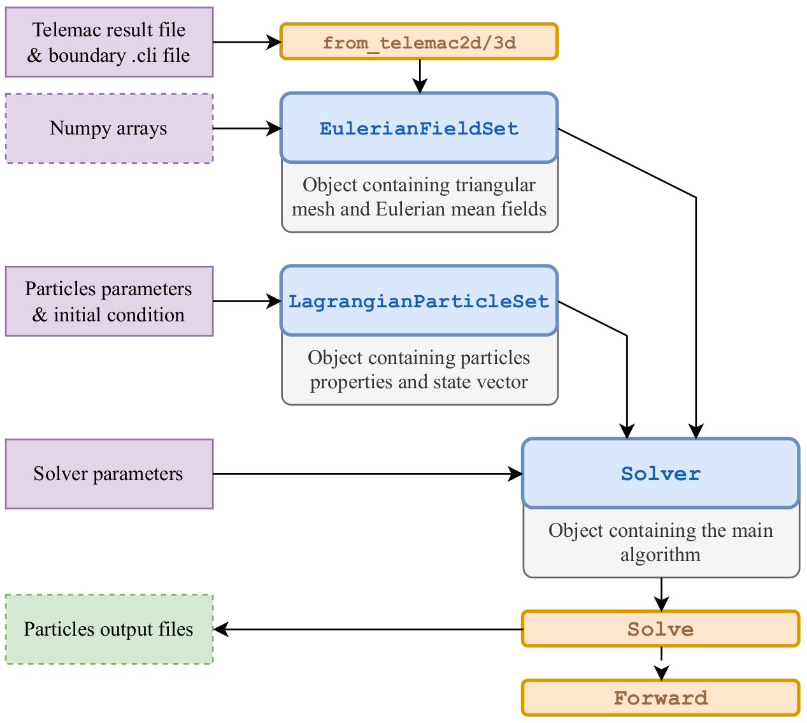

.. _setup:

******************************************************************************
Setup, inputs and practical informations
******************************************************************************

Setup philosophy
==============================================================================

CyLag is run using its Python API; to launch a simulation, one has to define a Python script in which cylag is imported and cylag objects are defined.
Each object has its own inputs and parameters:

1. ``EulerianFieldSet``: requires either a 2D or 3D hydrodynamic result file or NumPy arrays containing the Eulerian fields,
2. ``LagrangianParticleSet``: requires parameters related to the physical properties and initialization of particles,
3. ``Solver``: takes ``EulerianFieldSet`` and ``LagrangianParticleSet`` as inputs, as well as a ``parameters`` dictionary containing the main solver options.

The simulation script usually looks like this:

.. code-block:: python

  import cylag
   
  # 1. define EulerianFieldSet from TELEMAC-2D results:
  fset = cylag.EulerianFieldSet.from_telemac2d(
      'telemac_result_2d.slf',
      bnd_file='telemac_geo.cli')

  # 2. define LagrangianParticleSet:
  ini_position = np.asarray([
      [5000., 0.], 
      [5000., 500.], 
      [1000., 0.], 
      [1000., 500.]])

  pset = cylag.LagrangianParticleSet(
      position=ini_position, 
      dim=2, 
      initial_pool_size=4)

  # 3. define the solver:
  parameters = {
      'final_time': 43200.,
      'time_step': 1.,
      'model': 1,
      'time_scheme': 1,
      'listing': True,
      'listing_printout_period': 100,
      'output_file': True,
      'output_printout_period': 10,
      'output_file_format': 'txt',
      'output_file_name': 'particles_2d',
      }

  cylag_solver = cylag.Solver(fset, pset, parameters)

  # 4. run CyLag
  cylag_solver.solve()

.. note::
  The distinction between 2D and 3D is made based on the ``dim`` parameter of the ``EulerianFieldSet`` and ``LagrangianParticleSet`` objects.

Overview of input parameters
==============================================================================

In this section we provide a simple description of the main input parameters for each class.
Users can also refer to CyLag's API for a more complete description of inputs (types, array size, default values, etc.).

1 - EulerianFieldSet inputs
------------------------------------------------------------------------------

There are two ways to define the ``EulerianFieldSet`` object. 
The first one is to use the built in methods, in which case input parameters are automattically filled with imported values:

- ``EulerianFieldSet.from_telemac2d()``,
- ``EulerianFieldSet.from_telemac3d()`` or
- ``EulerianFieldSet.from_hdf5()``.

When initialize from TELEMAC, the main informations to provide are a result file (in .slf format) and a boundary condition file (in .cli format). Also optional fields can be added with a list name provided that they are save in the corresponding result file. An example is given here after:

.. code-block:: python

    file_name = os.path.join('data', 'r2d_meander.slf')
    bnd_file = os.path.join('data', 'geo_meander.cli')

    fset = cylag.EulerianFieldSet.from_telemac2d(
        file_name,
        bnd_file=bnd_file, 
        optional_fields=['TURBULENT ENERG.', 'DISSIPATION'])
        
.. note:: 

    Make sure the optional fields listed are saved in the ``.slf`` result file.

The second option is to pass inputs directly to ``EulerianFieldSet``, which are as follows:

- ``triangular_mesh`` : Triangular mesh containing geometry and connectivity
- ``dim`` : Dimension of the mesh and fields (2 or 3, default: 2)
- ``nlayers`` : Number of layers for 3D mesh (default: 1)
- ``times`` : Times at which fields were recorded
- ``elevation`` : Elevation field for each point of the mesh
- ``velocity_x`` : X-coordinate of the velocity field
- ``velocity_y`` : Y-coordinate of the velocity field
- ``velocity_z`` : Z-coordinate of the velocity field (3D only)
- ``opt_fields`` : Optional fields (default: None)
- ``opt_fields_names`` : Names of the optional fields (default: None)

2 - LagrangianParticleSet inputs
------------------------------------------------------------------------------

- ``position`` : initial particle coordinates x,y,z (default: None)
- ``velocity`` : initial particle velocity up,vp,wp (default: None)
- ``fluid_velocity_seen`` : initial fluid velocity seen us,vs,ws (default: None)
- ``dim`` : dimension 2 or 3 (default: 2)
- ``initial_pool_size`` : initial size of particle pool (default: size(position))
- ``min_pool_size_update`` : minimum size increment for pool expansion (default: 1000)
- ``particle_density`` : particle density (default: 1000.)
- ``particle_diameter`` : mean particle diameter (default: 0.01)
- ``particle_diameter_distribution`` : particle diameter distribution (default: None)

  - ``None``: constant diameter, monodisperse
  - ``['uniform', delta]``: U(``particle_diameter-delta``, ``particle_diameter+delta``)
  - ``['normal', std]``: N(``particle_diameter``, ``std``)
  - ``['lognormal', gsd]``: LN(``particle_diameter``, ``gsd``)
  - ``['weibull', shape]``: ``scale=particle_diameter/tgamma(1 + 1/shape)``

- ``drag_coefficient_model`` : model for the drag coefficient, LSM-2 only (default: 1)

  - 0: Constant drag model,
  - 1: Schiller et Nauman (1935),
  - 2: Almedeij (2008).

- ``drag_coefficient`` : constant drag coefficient for drag_coefficient_model=0, LSM-2 only (default: 0.44)
- ``added_mass_force`` : activate added mass force, LSM-2 only (default: False)
- ``added_mass_coef`` : added mass coefficient, LSM-2 only (default: 0.5)
- ``buoyancy_velocity_model``: add settling velocity, LSM-1 and pset.dim=3 only (default: 0)

  - 0 : Constant buoyancy velocity;
  - 1 : Analytical solution.

- ``buoyancy_velocity``: settling velocity in m/s, LSM-1 only (default: 0.0)
- ``compute_depth`` : compute particle depth to free surface, only for ``pset.dim=3`` (default: False)
- ``max_stranded`` : maximum number of stranded particles (default: ``initial_pool_size``)

.. note::

    - When ``position`` argument is given, the ``initial_pool_size`` is automatically set to the size of ``position`` 
      unless ``initial_pool_size`` is provided by the user. 

    - If ``position`` is not given and sources are used to add particles during the simulation,
      it is important to initialize ``initial_pool_size`` with a rough estimate 
      of the number of particles that will enter the domain with sources.
      The ``min_pool_size_update`` corresponds to the size of the increase in pool 
      size if the number of particles reach the ``initial_pool_size`` value during the computation.
      In that case, CyLag reallocates all particle attributes to match the new number of particles.
      This allocation change impacts performance, so it is recommended to fix
      a value that is not too low for ``min_pool_size_update``.

3 - Solver inputs
------------------------------------------------------------------------------

There are two types of solvers in CyLag:

- ``Solver`` : for sequential usage,
- ``SolverParallel`` for parallelization with MPI (particle are distributed among processes).

Both classes take the following arguments:

- ``field_set`` : Eulerian field set containing velocity and optional fields
- ``particle_set`` : Lagrangian particle set
- ``parameters`` : Model parameters (default: defined in cylag_dico.py)
- ``sources`` : List of particle sources (default: None)
- ``control_sections`` : List of control sections for statistics (default: None)

4 - Parameters dictionary
------------------------------------------------------------------------------

Complete list of available parameters in ``cylag_dico.py``:

**Time Parameters** 

- ``initial_time``: simulation start time (default: 0.0)
- ``final_time``: simulation end time (default: 3600.0)
- ``time_step``: time step size (default: 1.)
- ``frozen_eulerian_fields``: use first time step of EulerianFieldSet for steady-state flow (default: False)

**LSM Parameters**

- ``model``: Lagrangian Stochastic Model (default: 1)

  - 0 : testing kernel; 
  - 1 : LSM1; 
  - 2 : LSM2; 
  - 3 : LSM3.

- ``time_scheme``: integration scheme (default: depends on model)

  - 1 : Euler or Euler-Maruyama (default for LSM-1 with diffusion);
  - 2 : Runge-Kutta 2; 
  - 4 : Runge-Kutta 4 (default for LSM-1 without diffusion);
  - 5 : Direct integration (default for LSM-2 and 3);

- ``particle_velocity_init``: type of initialization for Up (default: 1)

  - 0 : user defined (zero if not specified),
  - 1 : interpolated from mean fluid velocity;

- ``rng_method``: random number generator method (default: 1)

  - 1 : rectangular approximation;
  - 2 : Ziggurat method (default);
  - 3 : Marsaglia’s polar method.

- ``lsm3_edge_opt``: edge-case treatment of the LSM-3 direct integrator (``time_scheme=5``) (default: 1)

  - 1 : normalized Taylor series (accurate for tiny steps and :math:`\mathcal{A}_1 = 1/T_L`);
  - 2 : closed-form coefficients with clipping: the degenerate denominator :math:`\mathcal{A}_1 - 1/T_L` is clipped, 
    and the covariance is clipped to remain positive semi-definite instead of raising an error.

**Physical Parameters**

- ``water_density``: density of water (default: 1000.)
- ``diffusion_model``: main diffusion model (default: 0)

  - 0 : no diffusion, 
  - 1 : constant diffusion coefficient, 
  - 2 : diffusion coefficient from :math:`k-\varepsilon` 
 
- ``horizontal_diffusivity``: horizontal diffusivity in m²/s for ``diffusion_model=1`` (default: 0.0)
- ``vertical_diffusivity``: vertical diffusivity in m²/s (default: 0.0)
- ``schmidt_number``: Schmidt number for turbulent ``diffusion_model=2`` and ``3`` (default: 1.0)
- ``diffusion_lsm2_option``: option for diffusion coefficient in LSM-2 (default: 1)

  - 0 : :math:`B_i` provided;
  - 1 : :math:`K_i` provided.

**Boundary Conditions**

- ``boundary_conditions``: enable BC handling (default: True)
- ``boundary_conditions_type``: type of BC handling (default: 0)

  - 1 : specular rebound;
  - 2 : diffuse rebound.

- ``boundary_conditions_debug``: verbose BC bounces for debug (default: False)
- ``max_wall_rebounds``: maximum wall bounces (default: 4)
- ``rebound_damping_coef``: damping on rebound (default: 0.5)

  - 0.0 : no kinetic energy loss;
  - 1.0 : total kinetic energy loss.

- ``wall_roughness_angle``: standard deviation (in degree) of the random perturbation 
  applied to the local wall normal to model diffuse rebounds (default: 15.0).
  low value corresponds to small roughness. Maximum value is 85 degrees.
  
- ``stranding_probability``: stranding probability (default: 0.)

  - 0.0 : no stranding;
  - 1.0 : always stranding.

**I/O Parameters**

- ``listing``: print progress (default: False)
- ``listing_printout_period``: iterations between prints (default: 10)
- ``output_rep``: name of the output repertory (default: "particles")
- ``output_file``: write particle positions (default: False)
- ``output_printout_period``: iterations between outputs (default: 10)
- ``output_file_format``: "vtk", "txt" or "all" ("all" save both file format, default: "txt")
- ``output_file_name``: name of the output file (default: "particles")
- ``bnd_statistics``: track boundary crossings (default: False)
- ``bnd_statistics_file_name``: base name of the boundary statistics files (default: "bnd_stats"),
- ``control_sections_file_name``: base name of the control sections files (default: "cs_stats"),
- ``stranding_output``: activate output file for stranded particles (default: False),
- ``stranding_output_file_name``: name of the output file for stranded particle (default: "stranded_particles"),

.. note::
  See the :ref:`Good_practices` for recommendations on how to set main input parameters for a simulation.
  
  
Adding particles to a simulation
==============================================================================

Adding particles to a simulation can be done in different ways:

- Add directly in initialization of ``LagrangianParticleSet``;
- Add via ``ParticleSource``;
- Add via ``ParticleSourceFromField``.

Note that both ``ParticleSource`` and ``ParticleSourceFromField`` use a time ``Scheduler``
object to trigger the addition of particles in the domain.
The time scheduler can be defined as follows:

.. code-block:: python

  source_scheduler = cylag.schedules(time_delta=5.)

Several options are available to schedule the addition of particles:

- ``ini_time`` (float) : Time at which the scheduler is initilised.
- ``time_delta`` (float) : Time delta between two tasks.
- ``iteration_delta`` (int) : Number of iterations between two tasks.
- ``times`` (list (float)) : Task times.
- ``iterations`` (list (int)) : Task time iterations.
- ``count`` (int) : Number of tasks, equally time-separated.
- ``always`` (bool) : Task is triggered at each time iteration.

1 - Add as input of ``LagrangianParticleSet``
------------------------------------------------------------------------------

The easiest way to define particles is to add them at the beginning of a simulation via the
``position`` argument of the ``LagrangianParticleSet`` class, such as:

.. code-block:: python

  ini_position = np.asarray([
      [5000., 0.], 
      [5000., 500.], 
      [1000., 0.], 
      [1000., 500.]])

  pset = cylag.LagrangianParticleSet(
      position=ini_position, 
      dim=2, 
      initial_pool_size=4)

Users can also define the initial particle velocity and the fluid velocity seen (for LSM-2 and LSM-3)
via the ``velocity`` and ``fluid_velocity_seen`` parameters.
These velocities can also be initialized from the interpolation of the mean fluid velocity if ``param:particle_velocity_init=1``.
Note that if ``particle_velocity_init=0`` and the ``velocity`` parameter is not specified, it is initialized to zero.

.. note::
  It is not recommended to set initial particle velocity to zero with LSM-2 and LSM-3.

2 - Add via ``ParticleSource``
------------------------------------------------------------------------------

When using the ``ParticleSource`` class, users need to specify a polygon in which to add particles,
as well as a time scheduler:

.. code-block:: python

  source_poly = np.array([[5.1, 0.5], [6.1, 0.5], [6.1, 1.5], [5.1, 1.5]])
  source_scheduler = cylag.schedules(time_delta=5.)
  source = cylag.ParticleSource(
      source_scheduler, 
      source_poly, 
      xy_method=1, 
      xy_npart=4)
      
The main parameters of the ``ParticleSource`` are as follows:

- ``scheduler``: class used to trigger the addition of particles
- ``poly``: contains the x and y positions of the polygon shape
- ``xy_method``: method of initialization on the horizontal plane (default: 0)

  - 0 : number of particles along x and y axis; 
  - 1 : total number of particles;
  - 2 : number of particles/m²)
  
- ``grid_res``: number of points on the x, y, and z axes
- ``xy_npart``: number of particles in the polygon
- ``xy_density``: number of particles per unit area in the polygon
- ``z_method``: method of initialization on the vertical axis (default: 0)

  - 0 : number of particles along z axis; 
  - 1 : number of particles layers;
  - 2: number of particles/m.

- ``z_npart``: number of particles along the vertical axis
- ``z_density``: number of particles per unit area along the vertical axis
- ``zmin``: minimum z value for vertical initialization
- ``zmax``: maximum z value for vertical initialization

3 - Add via ``ParticleSourceFromField``
------------------------------------------------------------------------------

The idea of ``ParticleSourceFromField`` is to trigger the release of particles when a specific condition
is met on a field of the ``EulerianFieldSet`` object. For example, particles can be added when a field reaches a given threshold.
The Eulerian fields used are specified with their ID (the number in the list of optional fields); two fields are required:

- ``field_id_criteria``: field used to compute the criterion;
- ``field_id_density``: field used for density when adding particles.

When using the ``ParticleSourceFromField`` class, two options are available: ``val`` (value) and ``var`` (variation) for adding particles:

- ``val``: the value of the field is compared to a ``threshold``;
- ``var``: the value of the field variation (``field[n+1]-field[n]``) is compared to a ``threshold``.

The following comparison options are available (see the ``criteria`` parameter):

- ``eq`` (==);
- ``neq`` (!=);
- ``geq`` (>=);
- ``leq`` (<=);
- ``gt`` (>);
- ``lt`` (<).

Finally, users need to provide the ``virtual_mass`` associated with particles in kg to control the amount of particles added to the domain (default: 1.):

- If ``virtual_mass == 1.``: ``npart = density*cell_area``;
- If ``virtual_mass != 1.``: ``npart = density*cell_area/virtual_mass``.

An example is given below:

.. code-block:: python

  source = cylag.ParticleSourceFromField(
      scheduler=cylag.schedules(always=True),
      field_id_criteria=7,
      field_id_density=7,
      criteria='var_neq',
      threshold=0.,
      virtual_mass=20.,
      single_release=True)

Saving particles
==============================================================================

Two output formats are available in CyLag:

- ``.vtk`` format: saves a list of files that can be loaded with ParaView;
- ``.txt`` format: saves a single ``particles.txt`` file that can be loaded with the ``ParticlesIO`` class of CyLag.

Post-processing particle files
==============================================================================

The ``ParticlesIO`` class included in CyLag allows quick and easy post-processing of particle files.
To load a particle file, simply use:

.. code-block:: python

  part = cylag.ParticlesIO.from_cylag_txt('particles/particles_2d.txt')

The positions can then be retrieved for any record (``rec``):

.. code-block:: python

  time = part.times[rec]
  x = part.xp[rec][:]
  y = part.yp[rec][:]

This class also allows simple computation of trajectories, based on all saved positions:

.. code-block:: python

  traj = part.get_trajectories(traj_list)

